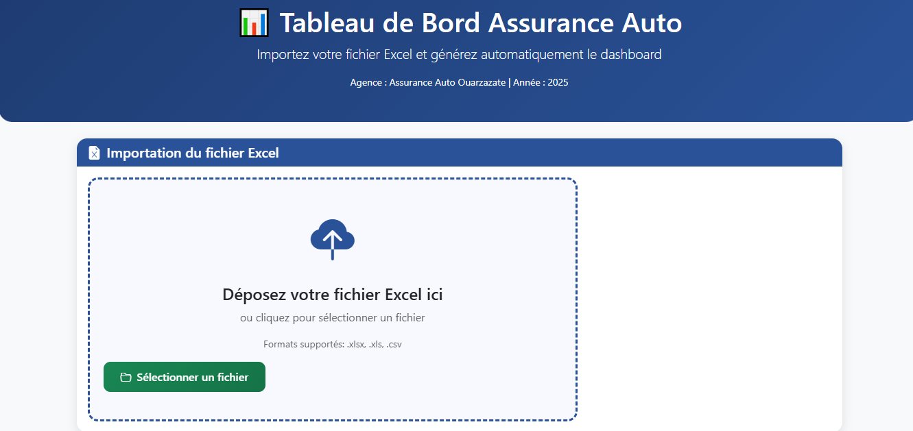
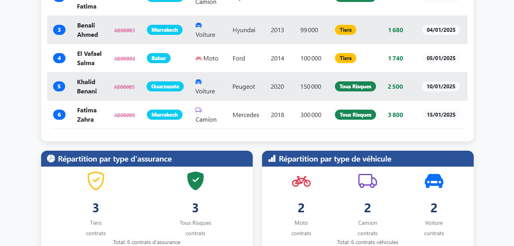

<p align="center">
  
</p>


# 📊 Dashboard Assurance Auto - Tableau de Bord Interactif

  

<p align="center">
  
  
  
  
  
  
</p>

  <p align="center">
  
</p>
  <p align="center">
  
</p>

## 🚗 Aperçu

  

Dashboard interactif pour la gestion d'une agence d'assurance automobile au Maroc. Développé dans le cadre de l'examen EFM "Culture et Techniques Avancée du Numérique" à l'ISTA Ouarzazate.

  

**Live Demo:** (https://lively-bunny-4e0b1e.netlify.app/)

  

## ✨ Fonctionnalités Principales

  

### 📈 Import de Données

- **Import Excel** : Support des formats .xlsx, .xls, .csv

- **Drag & Drop** : Interface intuitive de glisser-déposer

- **Validation** : Vérification du format des fichiers

- **Exemple inclus** : Fichier modèle téléchargeable

  

### 📊 Visualisation des Données

- **Indicateurs clés** : Contrats, primes moyennes, valeurs totales

- **Tableau interactif** : Affichage des contrats avec filtrage

- **Graphiques** : Répartition par type d'assurance et véhicule

- **Animations** : Compteurs dynamiques de 0 à la valeur finale

  
### 🔍 Analyse Avancée

- **Filtres dynamiques** : Ville, type d'assurance, type de véhicule

- **Recherche** : Filtrage en temps réel

- **Réinitialisation** : Bouton de reset des filtres

- **Responsive** : Compatible mobile, tablette et desktop

  

### 🎨 Interface Utilisateur

- **Design moderne** : Bootstrap 5 avec thème personnalisé

- **Animations** : Entrées fluides avec Animate.css

- **Icônes** : Bibliothèque Bootstrap Icons

- **Feedback** : Messages d'alerte et confirmations

  

## 🚀 Installation

  

### Option 1 : Utilisation directe

1. Téléchargez les fichiers

2. Ouvrez `index.html` dans votre navigateur

3. Commencez à importer vos fichiers Excel

  

### Option 2 : Déploiement local

```bash

\# Clonez le repository

git clone https://github.com/marouaneradi/assurance-auto-dashboard.git

  

\# Accédez au dossier

cd assurance-auto-dashboard

  

\# Ouvrez dans votre navigateur

\# Sous Windows :

start index.html

\# Sous Mac :

open index.html

\# Sous Linux :

xdg-open index.html

```

  

### Option 3 : Déploiement GitHub Pages

1. Forkez ce repository

2. Activez GitHub Pages dans les paramètres

3. Votre site sera disponible à : `https://marouaneradi.github.io/assurance-auto-dashboard`

  

## 📋 Format des Données Excel

  

### Colonnes requises

| Colonne             | Description                   | Exemple                   |
|---------------------|-------------------------------|---------------------------|
| **Nom_Prénom**      | Nom complet du client          | Radi marouane        |
| **CIN**             | Carte d'identité nationale    | AB00047                  |
| **Ville**           | Ville du client                | Ouarzazate                |
| **Type_Vehicule**   | Type de véhicule               | Voiture / Moto / Camion   |
| **Marque**          | Marque du véhicule             | Renault                   |
| **Année**           | Année du véhicule              | 2011                      |
| **Valeur**          | Valeur en MAD                  | 93000                     |
| **Type_Assurance**  | Type de contrat                | Tiers / Tous Risques      |
| **Prime_Base**      | Prime de base en MAD           | 1560                      |
| **Date_Souscription** | Date de souscription        | 02/01/2025                |


  

### Formats de date acceptés

- **JJ/MM/AAAA**
- **MM/JJ/AAAA**
- **AAAA-MM-JJ**

---

### Exemple de fichier

Un fichier exemple est disponible dans le dossier `examples/`  
ou téléchargeable directement depuis l’interface de l’application.

---

## 🛠️ Technologies Utilisées

### 🌐 Frontend
<p>
  
  
  
</p>


### 📚 Bibliothèques
<p>
  
  
  
</p>

### ⚙️ Outils
<p>
  
  
</p>


## 📁 Structure du Projet

  

```

assurance-auto-dashboard/

│
├── index.html                    # Page principale
├── README.md                     # Documentation
├── radi-marouane.xlsx                      # Licence MIT
├── radi-marouane.ppdx                  # Ressources statiques
│   radi-marouane.pdf                    # Styles CSS
│   


```


  ## 🔧 Configuration

### Personnalisation du thème

Modifiez `assets/css/style.css` pour changer les couleurs :

```css
:root {
    --primary-color: #1e3c72;     /* Couleur principale */
    --secondary-color: #2a5298;   /* Couleur secondaire */
    --accent-color: #198754;      /* Couleur d'accent */
    --text-color: #333;           /* Couleur du texte */
}
 ```
  

### Ajout de nouvelles fonctionnalités

1. Modifiez `assets/js/main.js` pour ajouter de nouvelles fonctionnalités
2. Ajoutez les éléments HTML correspondants dans `index.html`
3. Personnalisez le style dans `assets/css/style.css`

---

## 📱 Compatibilité

| Navigateur | Version minimale | Statut |
|------------|-----------------|--------|
| Chrome     | 60+             | ✅ Compatible |
| Firefox    | 55+             | ✅ Compatible |
| Safari     | 12+             | ✅ Compatible |
| Edge       | 79+             | ✅ Compatible |
| Opera      | 50+             | ✅ Compatible |


## 🧪 Tests

### Test des fonctionnalités

1. Importez le fichier exemple `exemples/exemple_contrats.xlsx`
2. Vérifiez que tous les indicateurs s'affichent correctement
3. Testez chaque filtre individuellement
4. Vérifiez le responsive sur différentes tailles d'écran

### Validation des données

- [x] Import Excel fonctionnel
- [x] Calculs automatiques corrects
- [x] Filtres dynamiques opérationnels
- [x] Animations fluides
- [x] Interface responsive


## 🤝 Contribution

  

Les contributions sont les bienvenues ! Voici comment contribuer :

  

1. **Fork** le projet

2. **Clonez** votre fork :

```
   git clone https://github.com/marouaneradi/dashbord.git
```

3. **Créez une branche** pour votre fonctionnalité :

```bash
   git checkout -b feature/ma-nouvelle-fonctionnalite
```

4. **Commitez vos changements** :

```bash
   git commit -m "Ajout d'une nouvelle fonctionnalité"
```

5. **Pushez vers votre fork** :

```bash
   git push origin feature/ma-nouvelle-fonctionnalite
```

6. **Ouvrez une Pull Request**

### Bonnes pratiques

- Suivez le style de code existant

- Ajoutez des commentaires pour le code complexe

- Testez vos modifications avant de soumettre

- Mettez à jour la documentation si nécessaire

## 📄 Licence

Ce projet est sous licence **MIT**. Voir le fichier (LICENSE) pour plus de détails.

### Vous pouvez :

- Utiliser librement le code

- Modifier et distribuer

- Utiliser à des fins commerciales

- Sous-licencier

  

### Vous devez :

- Inclure la notice de copyright originale

- Inclure une copie de la licence

  

## 👨‍💻 Auteur

  

**Étudiant :** Radi marouane

**Établissement :** ISTA Ouarzazate  

**Filière :** Développement Digital (Web FullStack)  

**Année :** 2025/2026  

**Module :** Culture et Techniques Avancée du Numérique  

  

### Remerciements

- **DeepSeek AI** pour l'aide au développement

- **Bootstrap** pour le framework CSS

- **SheetJS** pour la lecture des fichiers Excel

- **Tous les contributeurs** open source

  

## 🌐 Support

  

- **Problèmes techniques** : \[Ouvrir une issue\](https://github.com/marouaneradi/assurance-auto-dashboard/tree/main)

- **Questions** : Consultez la section \[FAQ\](#)

- **Améliorations** : Proposez vos idées via les issues

  

## 📞 Contact

  

Pour toute question ou suggestion :

- **Email** : radimarouane@gmail.com

- **GitHub** : (https://github.com/marouaneradi)

- **Site web** : https://marouaneweb.great-site.net/?i=1

  


  


### ⭐ Si ce projet vous a été utile, n'oubliez pas de mettre une étoile !

  https://github.com/marouaneradi/assurance-auto-dashboard/edit/main/

  

**Développé par Marouane Radi pour l'ISTA Ouarzazate**

  
